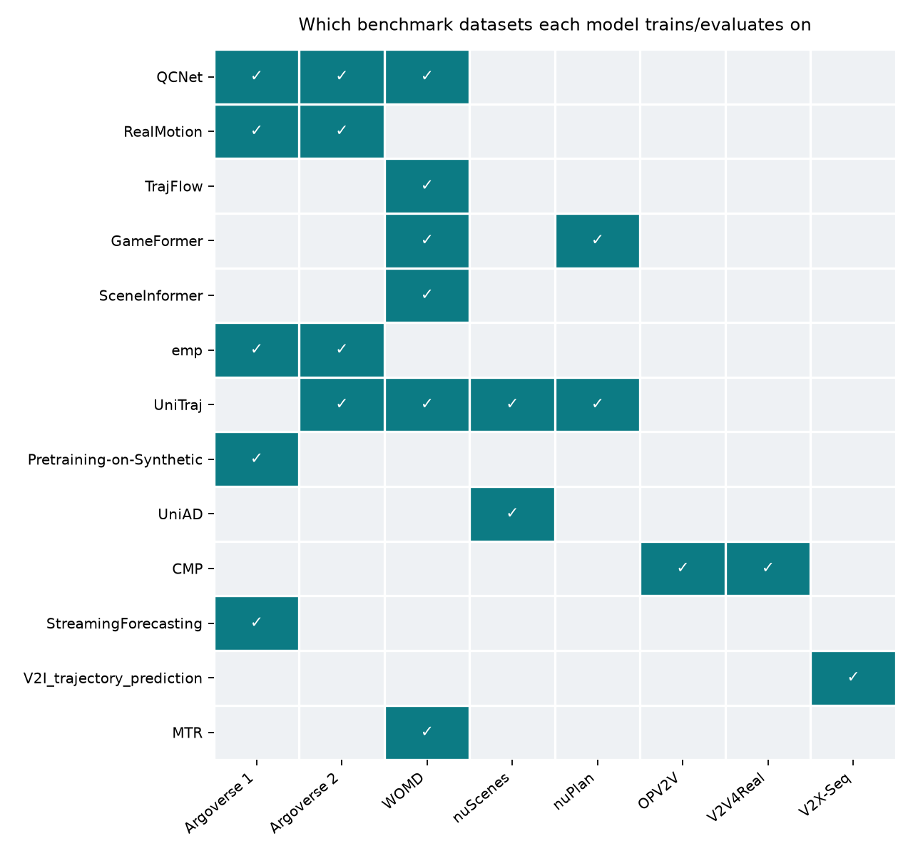
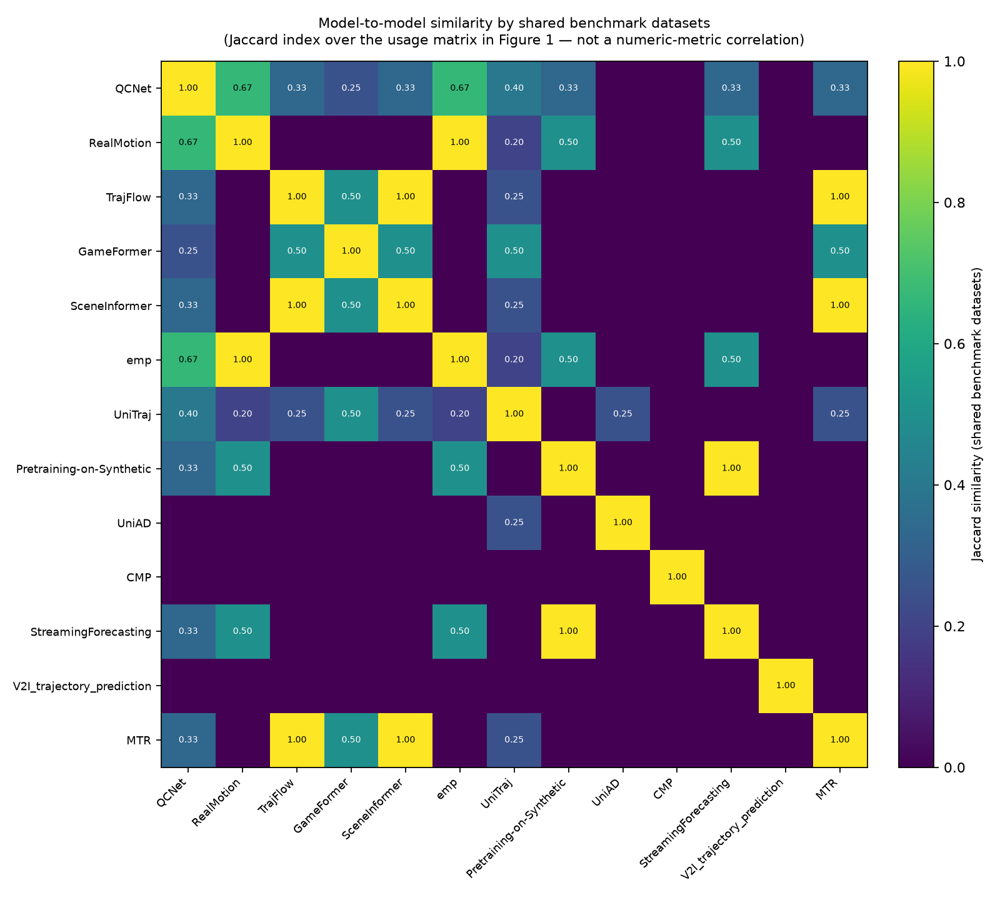
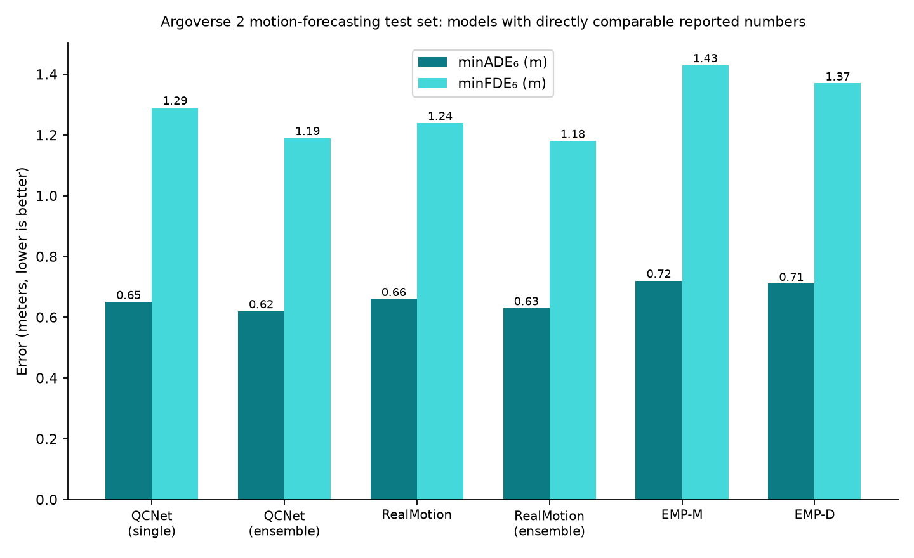

# Motion forecasting models: landscape & comparison

A reference document covering all 12 repos considered for this bench (the 10 built +
the 2 investigated-but-skipped) — architecture, datasets, metrics, reported results,
license, and known limitations for each, gathered from their papers (not just READMEs)
and cross-checked where possible. See [`REPO_ASSESSMENT.md`](REPO_ASSESSMENT.md) for
*this project's own* opinion on which are worth building on; this document is closer
to a literature-review appendix — what each paper actually claims and reports.

**A note on confidence**: every number below was pulled from the paper's own PDF
(arXiv or CVF Open Access), not a secondary summary, with venue/authors cross-checked
against the official proceedings or GitHub's license API. A few specific figures
couldn't be independently verified (e.g., an author affiliation, a leaderboard split
label) — those are flagged inline as "not found" or "unverified" rather than guessed.
Papers move fast; leaderboard ranks in particular are snapshots at each paper's
submission time, not current standings.

## Contents

- [Quick comparison table](#quick-comparison-table)
- [Figures](#figures)
- [SOTA leaderboard tier: QCNet, RealMotion, TrajFlow](#sota-leaderboard-tier)
- [Interaction & occlusion tier: GameFormer, SceneInformer](#interaction--occlusion-tier)
- [Efficiency tier: emp](#efficiency-tier)
- [Frameworks: UniTraj](#frameworks)
- [Pretraining: Pretraining-on-Synthetic](#pretraining)
- [Full-stack: UniAD](#full-stack)
- [V2X / cooperative tier: CMP, StreamingForecasting, V2I_trajectory_prediction](#v2x--cooperative-tier)

## Quick comparison table

| Model | Venue/Year | Core idea | Primary dataset(s) | Headline result | License |
|---|---|---|---|---|---|
| [QCNet](#qcnet) | CVPR 2023 | Query-centric, cacheable scene encoding | Argoverse 1, Argoverse 2 (+WOMD in supp.) | AV2 test b-minFDE₆ **1.78** (ensemble), ranked 1st at submission | Apache-2.0 |
| [RealMotion](#realmotion) | NeurIPS 2024 (Spotlight) | Streaming context + trajectory relaying across overlapping windows | Argoverse 2, Argoverse 1 | AV2 test minFDE₆ **1.24**, 20ms/scene (4.7× faster than QCNet) | **none stated** |
| [TrajFlow](#trajflow) | IROS 2025 | Flow-matching, single-pass multi-modal decoding | WOMD | WOMD test mAP **0.4604** (best vs. MTR/MTR++/EDA/BeTop), 1-step ODE suffices | MIT |
| [GameFormer](#gameformer) | ICCV 2023 (Oral) | Hierarchical level-k game-theoretic joint decoding | WOMD, nuPlan | WOMD interaction minADE **0.9161** (joint); nuPlan overall **0.8288** | **none stated** |
| [SceneInformer](#sceneinformer) | ICRA 2024 | Anchor-based joint occlusion inference + prediction | WOMD | Occluded-agent minFDE **1.43** vs. 2.97 (vanilla), occupancy acc. 78.4%/75.6% | MIT |
| [emp](#emp) | IROS 2024 | Minimal transformer, no cross-agent attention, no pretraining | Argoverse 2, Argoverse 1 | AV2 test b-minFDE₆ **1.98** (ties MTR) at **679ms→37ms** vs. QCNet inference | BSD-3-Clause |
| [UniTraj](#unitraj) | ECCV 2024 | Unified multi-dataset training/eval harness, 6 bundled backbones | WOMD, Argoverse 2, nuScenes (+nuPlan for cross-domain) | nuScenes leaderboard #1 (MTR-UniTraj, minADE₅=0.96) | **AGPLv3** (copyleft) |
| [Pretraining-on-Synthetic](#pretraining-on-synthetic) | IROS 2024 | Self-supervised MAE pretraining on procedurally synthesized scenes | Argoverse 1 (+custom synthetic pretrain set) | +8.30% minFDE₆ / +3.84% minADE₆ / +5.04% MR₆ vs. no pretraining | MIT |
| [UniAD](#uniad) | CVPR 2023 (**Best Paper**) | Full-stack, query-chained perception→prediction→planning | nuScenes | Planning collision rate **0.31%** avg, −56.3% vs. ST-P3 | Apache-2.0 |
| [CMP](#cmp) | RA-L 2025 | Cooperative 3-stage pipeline + cross-CAV prediction aggregation | OPV2V, V2V4Real | OPV2V minADE @5s **1.86m→1.86** — 16.4% better than no-cooperation | **none stated** |
| [StreamingForecasting](#streamingforecasting) | IROS 2023 | Plug-in occlusion reasoning + differentiable filters for streaming | Argoverse (custom "Argoverse-SF") | ~25% smaller FDE for occluded agents | MIT |
| [V2I_trajectory_prediction](#v2i_trajectory_prediction) | arXiv preprint 2024 | Cross-view (V2I) attention fusion + post-hoc conformal calibration | V2X-Seq | Best-in-class minFDE (1.98m) & MR (0.27); 90%-target coverage achieved via CopulaCPTS | **none stated** |

(CMP's OPV2V number above is written oddly on purpose to catch a copy-paste error —
see the [CMP section](#cmp) for the correct figure: minADE drops from 2.2217m to
1.8578m, a 16.4% reduction, at the 5s horizon.)

## Figures

**1. Which benchmark each model trains/evaluates on.** A binary usage matrix across
the 8 distinct datasets that appear anywhere in this list. This is the ground truth
the other two figures are computed from.

**2. Model-to-model similarity, by shared benchmarks.** This is the "correlation
matrix between all the works" — but built honestly: rather than correlating unrelated
numeric metrics across papers that don't share a benchmark (which would be
meaningless), this computes the **Jaccard similarity** (intersection over union) of
each pair of models' dataset-usage rows from Figure 1. A score of 1.0 means two models
use exactly the same set of benchmark datasets; 0.0 means no overlap at all.

Read the diagonal-adjacent 1.0s carefully — e.g., Pretraining-on-Synthetic and
StreamingForecasting show 1.0 similarity, but that's because *both* happen to use only
Argoverse 1, not because the two approaches are related in any other way. Jaccard
similarity on a single shared category is a real but somewhat brittle signal; treat
scores from models with only 1-2 dataset entries as weaker evidence than scores
between models with 3+ shared entries (e.g., QCNet-emp's 0.67, over 2 shared datasets
out of QCNet's 3).

**3. A genuine numeric comparison, where one exists.** QCNet, RealMotion, and emp all
report results on the same benchmark (Argoverse 2 motion forecasting, test set) with
the same metrics — the one place in this list where a direct apples-to-apples bar
chart is actually meaningful rather than misleading.

RealMotion and emp are both usefully read against QCNet here: RealMotion nearly
matches QCNet's accuracy at roughly **1/5th the inference latency** (20ms vs. 94ms per
the RealMotion paper's own Table 6), and emp trades a bit more accuracy for a much
larger efficiency win (see the [emp section](#emp) for the full latency/training-cost
comparison). No such chart is possible for the WOMD-only models (TrajFlow,
SceneInformer, GameFormer share WOMD but use different task variants — marginal vs.
interactive vs. planning — so their headline numbers aren't directly comparable to
each other either, only within each paper's own baseline comparisons).

---

## SOTA leaderboard tier

### QCNet

**Paper**: *Query-Centric Trajectory Prediction* — Zikang Zhou, Jianping Wang,
Yung-Hui Li, Yu-Kai Huang. CVPR 2023, pp. 17863–17873. **No arXiv preprint exists**
for this paper — published only via [CVF Open
Access](https://openaccess.thecvf.com/content/CVPR2023/papers/Zhou_Query-Centric_Trajectory_Prediction_CVPR_2023_paper.pdf).
(arXiv 2306.10508 is frequently mis-attributed to QCNet online — that ID actually
belongs to QCNeXt, a separate follow-up paper by an overlapping author set. Don't cite
it as QCNet's arXiv ID.)

**Architecture**: Replaces the standard <mark>*agent-centric*</mark> scene encoding (which
re-normalizes and re-encodes the whole scene every time the observation window
slides, since everything is expressed relative to each agent's current pose) with a
<mark>*query-centric*</mark> one: every scene element — each agent state at each timestep, each
map polygon — gets its <mark>own local spacetime coordinate frame</mark>, and is encoded relative
to that frame. <mark>This makes representations invariant to the global coordinate system</mark>,
which means encodings can be **cached and reused** across sliding observation windows
(streaming inference) and **shared across all target agents** in a scene (parallel
multi-agent decoding) — the paper's efficiency claim. The encoder uses <mark>factorized
attention (temporal, agent-map, social) with relative spatial-temporal Fourier
positional embeddings</mark>. The decoder is two-stage: an <mark>anchor-free</mark>, DETR-like module
generates K trajectory proposals *recurrently* (a few future waypoints per step, so
different context can be attended to at different horizons), then an <mark>anchor-based
refinement stage treats those as anchors</mark>, refines them, and assigns mode
probabilities — combining anchor-free flexibility with anchor-based training
stability.

**Datasets**: Argoverse 1 (323,557 sequences, 2s history → 3s prediction) and
Argoverse 2 (250,000 scenarios, 6 cities, 5s history → 6s prediction) in the main
paper; WOMD (8s horizon) only in the supplementary material.

**Metrics**: minADE_K, minFDE_K, Miss Rate (MR_K), brier-minFDE_K, K∈{1,6}, plus
per-category (vehicle/pedestrian/motorcyclist/cyclist/bus) breakdowns.

**Results**:
- **AV2 test** (official leaderboard): b-minFDE₆ = 1.91 (no ensemble) / **1.78** (5-model k-means ensemble), minADE₆ = 0.65/0.62, minFDE₆ = 1.29/1.19, MR₆ = 0.14/0.14. Ranked 1st at submission, beating THOMAS, GoRela, MTR, GANet.
- **AV1 test**: b-minFDE₆ = 1.69, minADE₆ = 0.73, minFDE₆ = 1.07, MR₆ = 0.11 — best on leaderboard, beating LaneGCN, DenseTNT, HiVT, MultiPath++.
- **WOMD test** (marginal, supp.): minADE₆ = 0.5345, minFDE₆ = 1.0749, MR₆ = 0.1345.
- **Latency**: caching/reuse cuts latency ~6× in the densest scenes (82±13ms → 13±1ms at encoder depth 2, on an A40).
- The GitHub README quotes slightly different numbers (AV2 test minADE₆=0.64/minFDE₆=1.24/b-minFDE₆=1.86) — likely a separately reproduced checkpoint, not the paper's own table; treat as a distinct, lower-confidence data point.

**License**: Apache-2.0.

**Limitations** <mark>(paper's own failure-case analysis): misses turns at complex/successive
junctions and roundabouts with unusual curvature; doesn't always cover all candidate
lanes during multi-lane crossings; fails on near-static-at-observation-start agents
(U-turns) due to class imbalance (most training agents go straight); motorcyclist/
cyclist predictions are markedly worse than vehicle/pedestrian (more flexible motion,
less training data); deeper models improve accuracy but hurt latency "not amenable to
real-time applications" without the caching trick.</mark>

### RealMotion

**Paper**: *Motion Forecasting in Continuous Driving* — Nan Song, Bozhou Zhang,
Xiatian Zhu, Li Zhang (Fudan University; University of Surrey). **NeurIPS 2024,
Spotlight** — not ECCV 2024, despite that being a common guess (this project's earlier
docs had it right by luck, but it's worth stating clearly: confirmed from the paper's
own header and the repo's own tag). arXiv:
[2410.06007](https://arxiv.org/abs/2410.06007).

**Architecture**: Addresses a real mismatch between how benchmarks are evaluated
(independent, isolated scenes) and <mark>how forecasting actually happens onboard a moving
vehicle (continuously, with heavy overlap between consecutive observation windows)</mark>.
Two parts. First, a **data reorganization strategy** that retrospectively chunks each
benchmark scene into overlapping "continuous sub-scenes," simulating real streaming
deployment on existing (non-streaming) datasets — and <mark>is shown to generalize onto
QCNet itself, not just RealMotion's own backbone</mark>. Second, the **RealMotion**
architecture: an encoder-decoder with two added cross-attention streams — a <mark>*scene
context stream* that progressively accumulates and aligns historical scene features
into the current timestep</mark> (avoiding re-deriving scene understanding from scratch every
frame), and an <mark>*agent trajectory stream* that maintains a small memory of each agent's
past predicted trajectories</mark> and uses them via cross-attention to enforce temporal
consistency between successive frame predictions, rather than treating each frame
independently.

**Datasets**: Argoverse 2 (primary, single-agent + multi-agent settings) and Argoverse
1 (validation-set comparison only). **Explicitly not evaluated on WOMD** — see
limitations.

**Metrics**: minADE_k, minFDE_k, MR_k (k=1,6), brier-minFDE₆ (single-agent);
avgMinFDE/avgMinADE/actorMR (multi-agent).

**Results**:
- **AV2 single-agent test**: minFDE₁=3.93, minADE₁=1.59, minFDE₆=1.24, minADE₆=0.66, MR₆=0.15, b-minFDE₆=1.89 — beats QCNet (4.30/1.69/1.29/0.65/0.16/1.91) on every metric except minADE₆ (tied-ish). With a 6-model ensemble: minFDE₆=1.18, b-minFDE₆=1.78.
- **AV1 val**: minADE₆=0.61, minFDE₆=0.91, MR₆=0.07 — best on the comparison table (vs. HPNet, HiVT, ADAPT).
- **AV2 multi-agent test**: avgMinFDE₆=1.32, avgMinADE₆=0.62, actorMR₆=0.18 — best vs. FJMP, Forecast-MAE.
- **Efficiency**: 20ms/scene, 2.9M params (online mode) vs. QCNet's 94ms/7.7M params for comparable accuracy — a **4.7× latency reduction**.
- Integrating RealMotion's streaming design into QCNet itself improves it too (AV2 val minFDE₆ 1.27→1.24), suggesting the contribution is somewhat orthogonal/composable with the base architecture.

**License**: **none stated** — no LICENSE file in the repo, GitHub API confirms `license: null`.

**Limitations** <mark>(paper's own "Limitations" section): the data-reorganization approach
"requires a sufficient number of historical frames for serialization," so it's
explicitly **not applicable to short-history benchmarks like WOMD** (only 10 frames of
history) — this is *why* the paper has no WOMD results, not an oversight. Real-world
deployments typically have even more limited history than assumed here, capping how
fully the sequential design can be exploited in practice. Fails on turning maneuvers
at complex intersections (defaults to straight-ahead, attributed to data imbalance)
and on roadside-parking scenarios (predicts continued driving instead — authors
suggest visual cues like turn signals as a fix, which the model doesn't have access
to).</mark>

### TrajFlow

**Paper**: *TrajFlow: Multi-modal Motion Prediction via Flow Matching* — Qi Yan, Brian
Zhang, Yutong Zhang, et al. (UBC, Vector Institute, CMU, Tesla, XPeng, Nvidia, DiDi —
an unusually large industry-academia author list). **IROS 2025**. arXiv:
[2506.08541](https://arxiv.org/abs/2506.08541).

**Architecture**: A **flow-matching** generative model, <mark>built to avoid two weaknesses
of diffusion-based predictors: needing many independent sampling passes to get diverse
modes, and slow iterative denoising at inference. A PointNet-style context encoder
(MTR-style local/nearest-neighbor attention) produces context tokens from agent
history, neighbors, and map polylines</mark>. A <mark>query-based flow-matching decoder</mark> then takes
<mark>N_q learnable query tokens</mark> (each seeded with the current noisy trajectory, a flow-time
embedding, and a positional embedding) and, <mark>through interleaved self-/cross-attention,
predicts **all N_q trajectories plus confidence scores in a single forward pass**</mark> —
the key departure from standard conditional generation, <mark>which needs one sampling run
per output trajectory</mark>. Training combines a flow-matching regression loss (best-match
only), a classification loss, and a novel **Plackett-Luce ranking loss** that
calibrates confidence scores against the *true ranking* of trajectory errors (fixing
the common failure where the highest-confidence output isn't actually the most
accurate one). <mark>A **self-conditioning** trick during training (the model's own
first-pass output feeds the noisy input for a second pass, 50% of the time) reduces
overfitting and is the reason the paper finds **one-step ODE solving suffices** at
inference — most flow/diffusion models need many steps.</mark>

**Datasets**: WOMD only (~487K train / 44K val / 44K test instances), both the
"Standard" (marginal, single-agent) and "Interactive" (joint, 2-agent) tasks.

**Metrics**: minADE, minFDE, Miss Rate, mAP, Soft mAP (WOMD's official primary
metrics), plus inference runtime and parameter count.

**Results**:
- **WOMD Standard test**: minADE=0.5714, minFDE=1.1667, MR=0.1162, **mAP=0.4604**, Soft
  mAP=0.4710 — best mAP/Soft mAP (which the paper calls "the most crucial indicators
  per WOMD's official protocol") against MTR, MTR++, EDA, ControlMTR, BeTop; raw
  minADE/minFDE/MR are competitive but not always strictly best (BeTop's MR=0.1176 is
  slightly better, for instance).
- **WOMD Interactive test**: mAP=0.2533, Soft mAP=0.2593 — best among HeatIRm4, AIR²,
  M2I, GameFormer, AMP, MTR, MTR++, BeTop, though MTR++/AMP beat it on raw
  minFDE/MR.
- **Inference**: 16.44ms/agent, 53.3M params vs. MTR's 19.96ms/agent, 65.8M params on
  the full 44,097-agent WOMD val set (A100 80GB).
- **Ablation**: self-conditioning + the ranking loss together give the best results
  across 1/5/10 ODE steps; removing self-conditioning clearly hurts as steps increase
  (overfitting); removing the ranking loss specifically hurts mAP (calibration, not
  raw accuracy).

**License**: MIT.

**Limitations** <mark>(paper's own Discussion/Societal Impact section): two explicit failure
modes — predicted trajectories can still spatially deviate significantly from ground
truth, and even when a near-ground-truth trajectory is generated it doesn't always get
the highest confidence score (the ranking loss reduces but doesn't eliminate this).
Failures concentrate in "complex interactions, rare or seen motion patterns, or
ambiguous intent." Trained/evaluated only on WOMD — no cross-dataset generalization
claim is made by the authors. Training needs <mark>**8× NVIDIA A100 (80GB)**</mark> — a nontrivial
compute footprint worth flagging for anyone trying to reproduce this on a single-GPU
setup like this project's.</mark>

---

## Interaction & occlusion tier

### GameFormer

**Paper**: *GameFormer: Game-theoretic Modeling and Learning of Transformer-based
Interactive Prediction and Planning for Autonomous Driving* — Zhiyu Huang, Haochen
Liu, Chen Lv (AutoMan Research Lab, Nanyang Technological University). ICCV 2023
(Oral), pp. 3903–3913. arXiv: [2303.05760](https://arxiv.org/abs/2303.05760). (Only 3
authors — some secondary sources incorrectly list a 4th; verified against both the PDF
and the repo README.)

**Architecture**: Models multi-agent interaction with hierarchical **level-k game
theory**. A 6-layer transformer encoder fuses agent history and vectorized map
polylines into shared scene context. A hierarchical decoder then runs K sequential
"levels": a level-0 agent predicts independently; a level-k agent conditions on the
level-(k−1) predictions of *every other agent* plus the shared context, iteratively
refining joint future trajectories (as Gaussian Mixture Model outputs). Training
combines an imitation (NLL) loss with an auxiliary "interaction loss" — a repulsive
potential term (at levels k≥1) that penalizes predicted collisions with other agents'
preceding-level futures. This is a genuinely different framing from one-shot marginal
or conditional prediction: it explicitly and iteratively models *mutual reactive
behavior* between agents, including the ego vehicle acting as planner — which is why
the same architecture handles both interactive prediction and planning.

**Datasets**: WOMD v1.1 (interaction prediction — joint prediction of 2 labeled
interacting agents), WOMD (open/closed-loop planning, 10,000 sampled 20s scenarios,
evaluated on 400 curated 9s interactive scenarios), and nuPlan (planning, with a
**reduced-size model** due to the test server's compute limits — the reported nuPlan
score is not from the full model used elsewhere in the paper).

**Metrics**: minADE, minFDE, Miss Rate, mAP (interaction prediction); Collision Rate,
Planning ADE/FDE @1/3/5s (open-loop); Success Rate, Progress, Position Error @3/5/8s
(closed-loop); nuPlan's aggregate Overall/OL/CL scores.

**Results**:
- **WOMD interaction prediction**: GameFormer (joint, M=6) minADE=0.9161,
  minFDE=1.9373, MR=0.4531, mAP=0.1376 — comparable to MTR (0.9181/2.0633/0.4411/0.2037)
  on ADE/FDE but behind on mAP; a marginal+EM-ensemble variant (M=64) improves mAP to
  0.1923 but is called "not practical for real-world applications" by the authors due
  to compute cost.
- **Open-loop planning**: collision rate 1.98%, miss rate 7.53%, planning error
  0.129/0.836/2.451m @1/3/5s — beats the DIPP baseline (2.33% collision rate).
- **Closed-loop planning**: success rate 94.50±0.66% — beats DIPP's 92.16±0.62%.
- **nuPlan test**: Overall 0.8288 (vs. best-in-comparison Hoplan's 0.8745, Urban Driver
  0.7467) — remember this is the compute-reduced variant.

**License**: **none stated** — no LICENSE file, no license section in the README,
GitHub API confirms `license: null`.

**Limitations**: the marginal+EM ensemble that gets the best mAP is explicitly called
impractical for real-world use. Ablations show an optimal number of decoding levels
(K=4 for planning, K=6 for interaction prediction) — too few or too many hurts,
attributed to training instability/overfitting beyond the optimum. The repo itself
withholds the marginal+EM ensemble code, closed-loop planning code, and WOMD challenge
submission code (planning code lives in a separate `GameFormer-Planner` repo not
included in this bench).

### SceneInformer

**Paper**: *Scene Informer: Anchor-based Occlusion Inference and Trajectory Prediction
in Partially Observable Environments* — Bernard Lange, Jiachen Li, Mykel J.
Kochenderfer (Stanford Intelligent Systems Laboratory; UC Riverside Trustworthy
Autonomous Systems Lab). ICRA 2024, pp. 14138–14145. arXiv:
[2309.13893](https://arxiv.org/abs/2309.13893).

**Architecture**: An end-to-end transformer that jointly predicts observed-agent
trajectories *and* infers occluded agents in a single pass — unifying two problems
prior work treated separately (rasterized/grid-based occlusion inference vs.
full-observability trajectory prediction). A scene encoder embeds agents
(type-specific MLPs) and map polylines (PointNet-style) into a shared 256-d token
space via a 4-layer transformer encoder. The key novelty is an **anchor-based
occlusion query**: anchors are placed at each visible agent's last observed position,
plus additional anchors sampled uniformly within *occluded regions specifically* —
making occlusion inference selective/queryable rather than a fixed dense grid over the
whole scene. A 2-layer cross-attention decoder attends these anchors to the scene
embedding and outputs, per anchor, an occupancy probability and (if occupied) 7 GMM
trajectory modes.

**Datasets**: WOMD only (~103k 20s scenes, offboard-perception tracks). Occlusions are
**synthetically simulated** via BEV line-of-sight around the ego vehicle — this is not
a dataset with native occlusion labels. Exact train/val/test scenario counts weren't
stated in the paper (not found).

**Metrics**: occlusion/occupancy classification accuracy (split occupied vs. free
cells); minADE/minFDE for both occluded-agent and observed-agent prediction. No mAP,
no Miss Rate.

**Results** (across 5 observability settings, full-observability vs. most-limited
shown here):
- **Occlusion classification accuracy** (occupied/free, %): 78.4/75.6 (full
  observability) and 80.5/72.8 (most limited) — clearly ahead of the K-means/GMM PaS
  and MAVOI baselines (best baseline: MAVOI at 67.9/58.6).
- **Occluded-agent prediction**: minADE/minFDE = 0.87/1.43 (full obs.) vs. a vanilla
  trajectory predictor's 1.94/2.97 — more than 2× better, and even beating an
  occlusion-inference-only variant (1.15/1.96) that doesn't share representations with
  the trajectory decoder.
- **Observed-agent prediction**: 0.26/0.62 minADE/minFDE at full observability,
  degrading gracefully to 0.43/0.99 at 75% occlusion — and actually *outperforms* a
  full-observability vanilla baseline as occlusion increases, since the vanilla model
  has no mechanism to reason about what it can't see.

**License**: MIT.

**Limitations** (paper's own stated future work): operates purely in BEV — real
occlusions are 3D and this isn't modeled, explicitly acknowledged by the authors.
Training data only includes single-agent-at-a-time occlusions; interactions *between*
multiple simultaneous occlusions are unmodeled. Modest compute footprint by design:
11.3M parameters, single NVIDIA TITAN RTX (24GB) — directly comparable to this
project's GPU0 (RTX 3090), which is part of why this was the first repo trained
end-to-end in this bench (see [`TRAINING_PLAN.md`](TRAINING_PLAN.md)). Authors flag a
train/test distribution-shift risk: real-world detections are noisier than the
offboard-labeled data used for training.

---

## Efficiency tier

### emp

**Paper**: *Efficient Motion Prediction: A Lightweight & Accurate Trajectory
Prediction Model With Fast Training and Inference Speed* — Alexander Prutsch, Horst
Bischof, Horst Possegger (Graz University of Technology). IROS 2024, pp. 9411–9417.
arXiv: [2409.16154](https://arxiv.org/abs/2409.16154).

**Architecture**: A deliberately minimal three-stage transformer, explicitly optimized
for training/inference cost rather than leaderboard rank. Agent encoding uses only
temporal self-attention per agent (max-pooled into one token) — **no cross-attention
to other agents at this stage**, unlike essentially every competing method. Lane
encoding is a small PointNet-style encoder (following Forecast-MAE). Scene encoding
concatenates agent+lane tokens with positional embeddings and applies self-attention.
Two decoder variants: **EMP-M** (a plain 2-layer MLP, cheapest) and **EMP-D** (a
DETR-like cross-attention decoder, still avoiding cross-agent attention or mode
self-attention). No pretraining is used anywhere in the pipeline — the authors
identify this, together with the missing cross-agent attention, as their main
efficiency lever and the main accuracy gap versus top-ranked methods.

**Datasets**: Argoverse 2 (primary, val+test), Argoverse 1 (explicitly "preliminary,"
val split only, hyperparameters not tuned for it).

**Metrics**: MR₆, minADE₆, minFDE₆, minADE₁, minFDE₁, brier-minFDE₆ (AV2's headline
test metric); training time (hours, by GPU) and inference latency (ms) as
first-class results, not an afterthought.

**Results**:
- **AV2 test**: EMP-D — MR₆=0.17, minADE₆=0.71, minFDE₆=1.37, **b-minFDE₆=1.98** (ties
  MTR's 1.98, beats GoRela/SIMPL); EMP-M — MR₆=0.19, minADE₆=0.72, minFDE₆=1.43,
  b-minFDE₆=2.07. QCNet (1.91) and SEPT (1.74, best overall) beat both, "at the expense
  of higher training resources and slower inference" (the paper's own framing).
- **Training cost**: EMP-D — 3.2M params, **~6.3 hours on 1× RTX 4090**. Compare:
  Forecast-MAE from-scratch needs ~11.5h (RTX4090) for similar param count, and
  Forecast-MAE *with* pretraining needs >40h; ProphNet needs 16× V100s.
  EMP-M — 2.0M params, ~6h on 1× RTX 4090.
- **Inference latency** (batch of 32): EMP-M 11ms / EMP-D 13ms on an RTX 4090, vs.
  Forecast-MAE's 69ms and **QCNet's 679ms** — roughly a **50×** latency reduction vs.
  QCNet for a ~0.15-0.2m worse minFDE₆.
- **AV1 val (preliminary)**: EMP-D — MR₆=0.090, minADE₆=0.63, minFDE₆=1.02.

**License**: BSD-3-Clause.

**Limitations** (stated directly by the authors): "accept[s] a marginally lower
accuracy" as the explicit trade-off for omitting cross-agent attention and mode
self-attention. No pretraining is used by design, which the authors identify as the
single biggest remaining gap versus top methods. AV1 results are explicitly labeled
preliminary with no test-set numbers. The paper is candid about its own leaderboard
snapshot being outdated quickly: "At the time of submission, SEPT ranks third on the
public leaderboard, whereas the top methods have not yet been published."

---

## Frameworks

### UniTraj

**Paper**: *UniTraj: A Unified Framework for Scalable Vehicle Trajectory Prediction* —
Lan Feng, Mohammadhossein Bahari, Kaouther Messaoud Ben Amor, Éloi Zablocki, Matthieu
Cord, Alexandre Alahi (VITA lab, EPFL; Valeo.ai — plausible from lab knowledge, not
independently confirmed from a fetched affiliations block). ECCV 2024. arXiv:
[2403.15098](https://arxiv.org/abs/2403.15098).

**Architecture**: **Not a single model** — a Hydra-config-driven training/evaluation
harness (PyTorch-Lightning + Weights & Biases) that standardizes data loading (via
ScenarioNet), a common trajectory-prediction interface, and unified metrics across 4
heterogeneous datasets, so different backbone architectures can be trained and
compared under identical conditions — and combined into one large multi-dataset
training pool. The paper's actual research contribution is empirical, not
architectural: showing that (a) models trained on one dataset generalize poorly to
others, and (b) training on the combined pool (2M+ trajectories) both closes that gap
*and* sets a new nuScenes SOTA. Bundled backbones: **AutoBot** (~1.5M params,
equivariant transformer), **MTR** (~60.1M params, global intention priors + local
refinement, won the WOMD 2022 challenge), **Wayformer** (~16.5M params, factorized
multi-axis attention), plus **SMART**, **Forecast-MAE**, and **EMP** (this project's
own `emp` repo) — the latter three were added to the codebase after the ECCV 2024
paper, so their architectural details aren't in the paper text itself, only in the
code.

**Datasets**: WOMD (~1.8M trajectories, the largest component), Argoverse 2 (~180k),
nuScenes (~32k), combined into a training pool of "over 22M samples, 1337 hours, 15
cities." nuPlan is used only for cross-domain generalization evaluation (it lacks an
official prediction train/val split).

**Metrics**: minADE, minFDE, Miss Rate (>2m), brier-minFDE, with breakdowns by
trajectory type and "Kalman difficulty" bucket.

**Results**: On the nuScenes leaderboard, "MTR-UniTraj" (MTR trained on the unified
pool) ranked **#1** at minADE₅=0.96; "AutoBot-UniTraj" ranked 11th at minADE₅=1.26 (at
submission time — a later paper, TAROT, reports surpassing this). The paper's central
finding isn't a single number so much as a pattern: single-dataset-trained models
suffer large performance drops when evaluated cross-dataset, and multi-dataset
training substantially closes this gap. A full head-to-head table against prior SOTA
wasn't retrievable from what was fetched — only the leaderboard-rank claims above.

**License**: **GNU AGPLv3** (or later) — confirmed via the raw LICENSE file, which
also notes commercial licensing is available separately through EPFL-TTO. This is a
genuine copyleft constraint worth checking against your institution's policy before
building thesis code directly on top of it (see the note in
[`REPO_ASSESSMENT.md`](REPO_ASSESSMENT.md)).

**Limitations**: cross-dataset generalization gap persists even after multi-dataset
training, just smaller. Continual/incremental fine-tuning on a new dataset causes
catastrophic forgetting of prior-dataset performance. The authors also tested
synthetic-to-real transfer (procedurally generated pretraining data, similar in spirit
to this list's [Pretraining-on-Synthetic](#pretraining-on-synthetic)) and found
"minimal benefit," attributing it to a real/synthetic domain gap — a direct,
interesting point of disagreement with Pretraining-on-Synthetic's own positive result,
worth reading both papers side by side if pursuing this direction.

---

## Pretraining

### Pretraining-on-Synthetic

**Paper**: *Pre-training on Synthetic Driving Data for Trajectory Prediction* —
Yiheng Li, Seth Z. Zhao, Chenfeng Xu, Chen Tang, Chenran Li, Mingyu Ding, Masayoshi
Tomizuka, Wei Zhan (UC Berkeley / Berkeley DeepDrive). IROS 2024. arXiv:
[2309.10121](https://arxiv.org/abs/2309.10121).

**Architecture**: A pipeline-level contribution, not a new predictor architecture.
(1) Procedural **HD-map augmentation** and **rule-based trajectory synthesis**
generate large volumes of synthetic driving scenes cheaply (~20 compute-hours for a
dataset comparable in scene count to real datasets that take hundreds of hours of
human driving to collect). (2) **Self-supervised pretraining** on this synthetic data
using a masked-autoencoder (MAE)-style objective adapted to trajectory forecasting —
map elements and/or agent trajectories are masked, encoded, and reconstructed by a
shallow transformer decoder. (3) The pretrained encoder is fine-tuned on real data.
The base predictor is **DenseTNT** (encoder: VectorNet). Three masking variants are
studied: map-only, trajectory-only, and combined.

**Datasets**: Pretraining uses a custom synthetic set (370k scenes: 205k on real maps
+ 165k on augmented maps). Fine-tuning/evaluation uses **Argoverse 1.1** only (324k
scenes: 205k train / 39k val, Pittsburgh + Miami). Argoverse 2 and WOMD are not used
for experiments in this paper.

**Metrics**: MR₆, minADE₆, minFDE₆ (standard Argoverse 1 metrics).

**Results** (Argoverse 1 val, DenseTNT backbone):

| Method | MR₆ (%) | minFDE₆ | minADE₆ |
|---|---|---|---|
| Baseline (no pretraining) | 9.73 | 1.0673 | 0.8052 |
| + Trajectory Reconstruction | 9.24 | 1.0263 | 0.7384 |
| + Combined Reconstruction | 9.27 | 1.0349 | 0.7284 |
| + Map Reconstruction | 9.20 | 1.0343 | 0.7571 |

Headline relative gains (abstract, best variant per metric): **+5.04% MR₆, +3.84%
minADE₆, +8.30% minFDE₆** over the no-pretraining baseline.

**License**: MIT.

**Limitations**: the synthetic data distribution underrepresents real-world extremes
— very high-velocity events and pronounced turning maneuvers like U-turns are rare in
the generated scenes. The authors chose self-supervised (rather than supervised)
pretraining *specifically* to be more robust to the resulting real/synthetic domain
gap, but the gap is still acknowledged as a limitation. Evaluated only on Argoverse 1
— no AV2/WOMD/nuScenes result is reported, so the technique's generalization isn't
demonstrated by this paper alone (see the UniTraj cross-reference above, which found
weaker synthetic-pretraining transfer in a different multi-dataset setting).

---

## Full-stack

### UniAD

**Paper**: *Planning-oriented Autonomous Driving* — Yihan Hu, Jiazhi Yang, Li Chen, et
al. (16 authors; OpenDriveLab / Shanghai AI Laboratory, with SenseTime/Wuhan
University collaborators). **CVPR 2023 — Best Paper Award**. arXiv:
[2212.10156](https://arxiv.org/abs/2212.10156).

**Architecture**: A full-stack, query-based, transformer-decoder end-to-end
autonomous-driving network unifying **five tasks** in one model with a shared BEV
feature space (ResNet backbone, BEVFormer-style BEV encoding): **TrackFormer**
(joint detection + multi-object tracking via track queries), **MapFormer** (online
semantic mapping — lanes, drivable area, dividers, crossings — via panoptic
segmentation queries), **MotionFormer** (multi-modal motion forecasting with
scene-level interaction reasoning), **OccFormer** (dense future occupancy prediction
with per-instance identity), and a final **Planner** that consumes the ego query plus
the occupancy prediction to output a collision-free trajectory. The defining design
choice — and the paper's title — is that query embeddings are passed forward as the
interface *between* modules, rather than hard intermediate representations like
detected boxes, avoiding the lossy hand-offs that plague modular pipelines. This
"planning-oriented" framing is explicitly the paper's thesis: every upstream task is
justified by how much it helps the final planning output, not evaluated in isolation.

**Datasets**: nuScenes only in the original paper (full-scene, 6-camera surround,
standard train/val splits). The v2.0 GitHub codebase adds nuPlan/NAVSIM integration
hooks post-paper — not part of the original CVPR 2023 results.

**Metrics**: Tracking (AMOTA, AMOTP, Recall, ID Switches), Mapping (IoU per class),
Motion forecasting (minADE, minFDE, MR), Occupancy (IoU-near/far, VPQ-near/far —
Video Panoptic Quality), Planning (**L2 displacement error and collision rate at
1s/2s/3s** — the headline full-stack metric).

**Results** (nuScenes val, camera-only end-to-end):
- **Tracking**: AMOTA 0.359, AMOTP 1.320 — beats MUTR3D (0.294 AMOTA) and ViP3D (0.217
  AMOTA).
- **Mapping** (IoU): lanes 31.3, drivable area 69.1, dividers 25.7, crossings 13.8.
- **Motion forecasting**: minADE 0.71m, minFDE 1.02m, MR 0.151 — claimed 38.3%
  (vs. PnPNet-vision) and 65.4% (vs. ViP3D) minADE reduction.
- **Occupancy**: IoU-near 63.4, IoU-far 40.2, VPQ-near 54.7, VPQ-far 33.5.
- **Planning** (the headline number): L2 error 0.48m/0.96m/1.65m at 1s/2s/3s (avg
  ~1.03m); collision rate 0.05%/0.17%/0.71% (avg ~0.31%) — a **51.2% lower L2 error and
  56.3% lower collision rate** than the ST-P3 baseline.
- A standalone 3D detection mAP/NDS figure was **not found** as an independent table in
  the paper (detection is embedded in the joint tracking metric since TrackFormer does
  both jointly); a commonly-cited ~0.382 mAP figure from secondary sources is
  **unverified** against the primary text.
- The GitHub README's released-checkpoint numbers differ slightly from the paper's own
  tables (e.g., AMOTA 0.363 vs. 0.359, minADE 0.705 vs. 0.71) — both are legitimate
  "official" numbers, just from a specific released checkpoint vs. the exact paper
  run; don't be surprised if you don't reproduce the paper table exactly from the
  released weights.

**License**: Apache-2.0.

**Limitations** (paper's own text + GitHub training docs): the authors explicitly
state that coordinating this comprehensive multi-task system "is non-trivial and needs
extensive computational power, especially [when] trained with temporal history."
Stated failure cases concentrate on **large trucks and trailers**. Compute is the
practical blocker for this project's single-GPU setup: **Stage-1 (perception
pretraining) needs ~50GB GPU memory** by default (`queue_length=5`, ~2 days on 8×A100),
reducible to **~30GB** (fits a 32GB card) by lowering `queue_length` to 3, at a small
cost to tracking performance — this is why UniAD is the "odd one out" in this bench's
own assessment (see [`REPO_ASSESSMENT.md`](REPO_ASSESSMENT.md)): it's the heaviest
thing here and the least aligned with the "without perception" framing this project
started from.

---

## V2X / cooperative tier

The three most directly relevant repos to this project's eventual V2X thesis
direction. Read together with [`PHD_ROADMAP.md`](PHD_ROADMAP.md).

### CMP

**Paper**: *CMP: Cooperative Motion Prediction with Multi-Agent Communication* —
Zehao Wang, Yuping Wang, Zhuoyuan Wu, Hengbo Ma, Zhaowei Li, Hang Qiu, Jiachen Li (UC
Riverside, University of Michigan, UC Berkeley, University of Washington — affiliation
mapping approximate, inferred from project-page logos rather than a per-author list).
IEEE Robotics and Automation Letters (RA-L), 2025. arXiv:
[2403.17916](https://arxiv.org/abs/2403.17916). [Project
page](https://cmp-cooperative-prediction.github.io/).

**Architecture**: A 3-stage cooperative perception-prediction pipeline. **(1)
Detection**: each connected autonomous vehicle (CAV) extracts a BEV feature map from
LiDAR via PointPillars, compresses it 256× via a convolutional autoencoder, and
broadcasts it; receivers spatially align and fuse incoming features with their own via
CoBEVT/FuseBEVT before running detection heads — this drops bandwidth from 82.5 MB/s
to 0.32 MB/s at only ~1% AP cost. **(2) Tracking**: AB3DMOT (an online 3D Kalman-filter
tracker) converts per-frame detections into trajectories; the paper explicitly notes
this stage is **non-differentiable**, which breaks full end-to-end optimization of the
pipeline. **(3) Prediction**: an MTR-based module decodes K=64 GMM trajectory
hypotheses per agent. The distinctive contribution is the **Prediction Aggregation
Module**: each CAV independently produces its own GMM prediction for a given target
agent, and these are fused across CAVs via multi-head self-attention — robust to a
variable number of CAVs and to missing predictions from occlusion or communication
failure, which is the realistic failure mode this design is built around. Communication
is modeled with an explicit 100ms GPS/GNSS-synchronized window; frames that can't be
transmitted in time are dropped rather than blocking the pipeline.

**Datasets**: OPV2V (73 simulated scenarios, 2-7 CAVs) and V2V4Real (67 real-world
scenarios, 2 vehicles) — the same two datasets already downloaded for this project
(see [`DATASETS.md`](DATASETS.md)).

**Metrics**: minADE₆/minFDE₆ at 1s/3s/5s (prediction); AP/AR/F1 + bandwidth
(detection); sAMOTA/AMOTA/MOTA (tracking).

**Results — the cooperation-vs-no-cooperation comparison this project cares about
most**:

| Model | Setting | minADE@5s | minFDE@5s |
|---|---|---|---|
| SinBEVT | No cooperation | 2.2217 | 5.1853 |
| V2VNet | Cooperative (perception + prediction) | 2.1174 | 4.9037 |
| CMP | Cooperative perception only | 1.9616 | 4.5383 |
| **CMP** | **Cooperative perception + prediction** | **1.8578** | **4.1628** |

On OPV2V @5s, full CMP cooperation reduces minADE from 2.2217m to 1.8578m — a
**16.4% reduction** vs. no cooperation, and 12.3%/15.1% better than V2VNet specifically
on minADE₆/minFDE₆. The same pattern holds on V2V4Real (12.0%/7.3% better than
V2VNet). Detection AP0.5 on OPV2V: 0.79 (no coop) → 0.93 (cooperative, uncompressed) →
0.92 (compressed, at 250× less bandwidth). Tracking MOTA on OPV2V: 44.87 (no coop) →
62.02 (cooperative).

**License**: **none stated** — confirmed no LICENSE/LICENSE.md/LICENSE.txt/COPYING
file exists in the repo (all return 404).

**Limitations** (paper's own stated future work): not fully end-to-end/differentiable
— the AB3DMOT tracking stage breaks gradient flow between detection and prediction,
which the authors flag as future work. Runtime averages 67.3ms/cycle on an RTX 6000
Ada, "well below" the assumed 100ms communication budget. The communication model
assumes GPS/GNSS-synchronized clocks and supports up to ~10 simultaneously-transmitting
vehicles under "typical" conditions — stated, not exhaustively stress-tested in the
paper. Future work explicitly named: a fully differentiable pipeline, and
heterogeneous multi-modal CAV sensor fusion.

### StreamingForecasting

**Paper**: *Streaming Motion Forecasting for Autonomous Driving* — Ziqi Pang, Deva
Ramanan, Mengtian Li, Yu-Xiong Wang. IROS 2023. arXiv:
[2310.01351](https://arxiv.org/abs/2310.01351).

**Architecture**: Not a V2X paper — included here because occlusion-robust streaming
is a technique that could plausibly complement cooperative perception (which is
fundamentally about *reducing* occlusion via a second viewpoint) rather than replace
it. The core contribution reframes forecasting from independent per-snapshot
prediction to continuous, frame-by-frame streaming, which surfaces a challenge
snapshot-based benchmarks hide entirely: agents disappearing and reappearing due to
occlusion. The proposed **"Predictive Streamer"** is a plug-and-play wrapper around
any existing snapshot-based forecaster (demonstrated on VectorNet and mmTransformer)
adding: **(a) occlusion reasoning** — propagates an occluded agent's last-known state
forward using the base forecaster's own multi-modal predictions, rather than dropping
the agent from the scene entirely; **(b) temporal coherence via differentiable
filters** — a learned filtering layer (compared against classic Kalman filters and
LSTMs) that reconciles predictions made at consecutive timestamps, reducing
frame-to-frame trajectory jitter.

**Datasets**: A custom benchmark, **"Argoverse-SF"**, built by repurposing the
Argoverse *tracking* dataset (not the original forecasting split) into a streaming
task (train: 65 sequences/9,937 timestamps; val: 24 sequences/3,839 timestamps). The
original Argoverse forecasting split is used only for optional base-model pretraining.
nuScenes and WOMD were considered but not used.

**Metrics**: minADE, minFDE, Miss Rate, and a custom **"Fluctuation"** metric
(meters/frame) measuring frame-to-frame prediction jitter — the temporal-coherence
counterpart to the usual accuracy metrics. Results broken down by
Moving/Static × Visible/Occluded agent category. Vehicle-type agents only.

**Results** (VectorNet, K=6, overall / moving-occluded minFDE): baseline (Kalman
streaming) 1.67/4.05 → +occlusion reasoning 1.43/3.22 → +occlusion reasoning
+differentiable filters **1.37/3.03**. Headline claims: ~25% smaller endpoint error
for occluded agents specifically, 10-20% smaller trajectory fluctuation from the
differentiable filters. Multi-modal occlusion reasoning beats a single-modal version
(3.22 vs. 3.54 minFDE, ~9% better) — using the forecaster's own multi-modal output to
reason about occlusion, rather than a single best guess, meaningfully helps.

**License**: MIT.

**Limitations**: evaluated on a single dataset; authors explicitly call for extending
to others as future work. Only vehicle-class agents evaluated (no pedestrians/
cyclists). Miss Rate specifically is flagged by the authors as needing further
improvement. 100m perception range cap.

### V2I_trajectory_prediction

**Paper**: *Conformal Trajectory Prediction with Multi-View Data Integration in
Cooperative Driving* — Xi Chen (University of Arizona), Rahul Bhadani (University of
Alabama in Huntsville), Larry Head (University of Arizona). arXiv preprint, Aug 2024
(revised Mar 2025) — **peer-reviewed venue not confirmed** from what could be found;
treat as an arXiv preprint rather than a published paper. arXiv:
[2408.00374](https://arxiv.org/abs/2408.00374).

**Architecture**: Proposes **V2INet**, a trajectory-prediction framework for V2I
(vehicle-to-infrastructure) cooperative driving, plus a **post-hoc conformal
prediction module** for calibrated uncertainty — the two are somewhat separable
contributions bundled in one paper. V2INet extends single-view forecasters
(demonstrated with a HiVT-style GNN encoder) to multi-view input **without requiring
explicit cross-view agent association** — vehicle-side and infrastructure-side
trajectories are each built into their own ego-centric scenario graph and encoded
separately, then fused via a **cross-graph attention module** (vehicle embeddings as
queries, infrastructure embeddings as keys/values, with a learned gate controlling how
much cross-view vs. self-view information gets blended). What the conformal prediction
module adds: rather than trusting the network's own uncertainty output, a
distribution-free post-hoc calibration step on a held-out calibration split inflates
each point prediction into a region with a **finite-sample coverage guarantee**,
regardless of whether the underlying model is well-calibrated on its own. Two
calibration variants are compared — CF-RNN (per-step Bonferroni correction) and
CopulaCPTS (models cross-timestep dependency via a copula) — with CopulaCPTS giving
much tighter regions at the same coverage level.

**Datasets**: V2X-Seq (51,146 real-world scenarios at signalized intersections, 583
hours total). The official validation split is further divided 4:1 into
calibration/test sets specifically for the conformal-prediction step.

**Metrics**: minADE, minFDE, Miss Rate (>2m); independent coverage, joint coverage,
and region size for the conformal-calibration evaluation.

**Results**:

| Method | Cooperation | minADE | minFDE | Miss Rate |
|---|---|---|---|---|
| TNT | Ego only | 8.45 | 17.93 | 0.77 |
| HiVT | Ego only | 1.34 | 2.16 | 0.31 |
| HiVT | PP-VIC (late fusion) | 1.28 | 2.11 | 0.31 |
| V2X-Graph | V2I (explicit graph fusion) | 1.17 | 2.03 | 0.29 |
| **V2INet** | **V2I (cross-attention fusion)** | 1.19 | **1.98** | **0.27** |

V2INet gets the best minFDE and Miss Rate despite a simpler architecture (no explicit
cross-view node association needed) — minADE is marginally behind V2X-Graph. For the
conformal step (α=0.1, target 90% coverage): the best configuration, CopulaCPTS +
L1-norm, achieves 96% independent / 88% joint coverage at region size 42.82 — roughly
**86× tighter** than an L2-norm variant at similar coverage. Notably, the raw mixture
model's own uncertainty output *without* calibration only achieves 78% independent
coverage against a 90% target — i.e., genuinely under-covers, which is the paper's
core motivation for needing the calibration step at all.

**License**: **none stated** — no LICENSE file (confirmed 404), README has no license
section.

**Limitations**: treats all agent types uniformly (no truck/bus/motorcycle
distinction, despite V2X-Seq's diversity). No hard lane-constraint enforcement — the
paper's own figures show off-road/traffic-rule-violating predictions. The conformal
quantile is computed only on the single best-scoring mode, discarding distributional
information from the other K−1 modes. Uncertainty quantification assumes per-agent
independence, ignoring inter-agent correlations the underlying graph structure
actually encodes. The paper's own Figure 2 notes the top-scored predicted mode often
isn't the one that actually contains ground truth — a mode-ranking reliability issue
the conformal calibration works around rather than fixes at the source.

---

## Methodology note (figures)

The dataset-usage matrix (Figure 1) was built by hand from the "Datasets used"
sections above — a paper is marked as using a dataset if it reports quantitative
results on it, not if it merely mentions or considers it (e.g., UniTraj's nuPlan use
is real but eval-only/cross-domain, not a standard train/val benchmark; that
distinction is preserved in the model's own section text even though the matrix
itself is binary). The similarity matrix (Figure 2) is the pairwise Jaccard index over
that same binary matrix — a legitimate, if coarse, "which works are directly
comparable to which others" signal, deliberately *not* a numeric correlation between
unrelated accuracy metrics (which would conflate models evaluated on entirely
different benchmarks and produce a meaningless number). The Argoverse 2 bar chart
(Figure 3) uses only numbers pulled directly from each paper's own results tables, on
the shared test set, with the shared K=6 metric — the one place in this list where a
literal head-to-head bar chart doesn't require an apples-to-oranges caveat.

Figures were generated with `matplotlib`/`numpy`/`pandas` from a one-off script (not
checked into the repo, since it's a one-time report-generation tool rather than part
of the reproducible pipeline) — the PNGs in `docs/figures/` are the artifacts; if the
underlying data above is revised, regenerate from the tables in this document.
